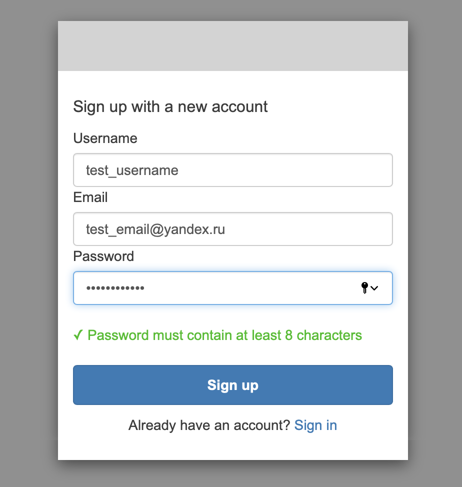
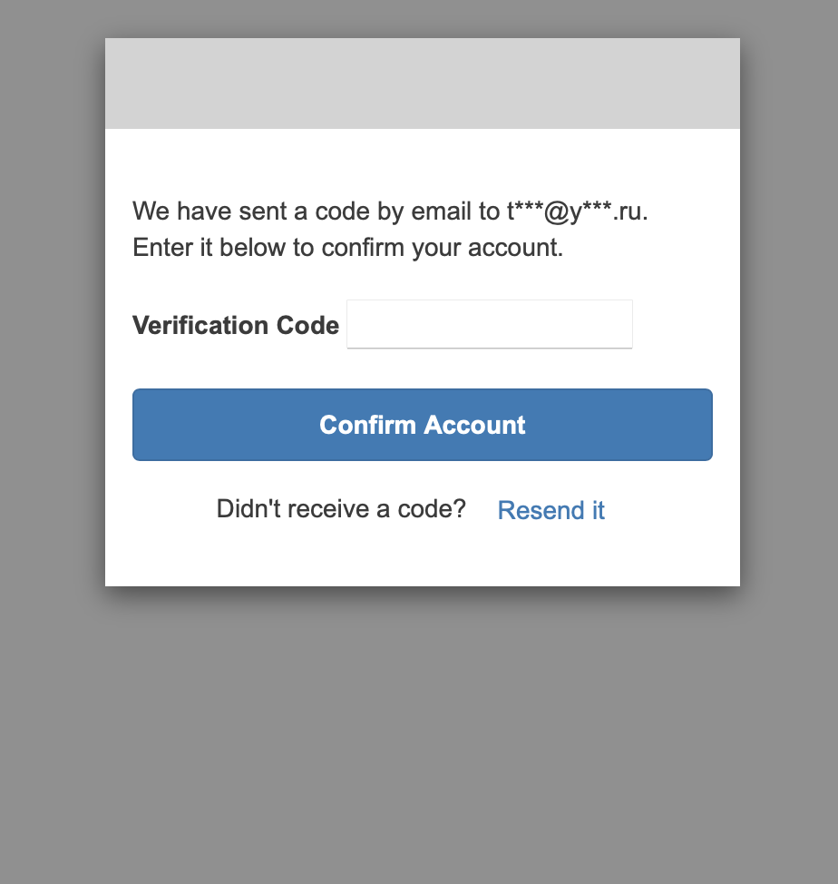

# Announcements MicroService
[](https://www.python.org/downloads/release/python-39/)
[](https://github.com/anastasiia-a/announcement-ms/actions/workflows/checks.yml)

## Overview
A small serverless application (MicroService) which exposes JSON formatted REST APIs which allow for storing and retrieving announcements. The application consists of `DynamoDB Table`, `Lambda` to read data from the DB, `Lambda` to write data to the DB, `Lambda` for token auth, `API Gateway`.


### Solutions and standards

* OpenAPI 3.0
* Formation Scripts
* AWS Serverless services
* Postman Collections


## How to deploy
#### 1. Install aws cli
```
https://docs.aws.amazon.com/cli/latest/userguide/install-cliv2.html
```
#### 2. Clone the repository
```
git clone https://github.com/anastasiia-a/announcement-ms
```
#### 3. Export needed environment variables
```
export AWS_ACCESS_KEY_ID=
export AWS_SECRET_ACCESS_KEY=
export AWS_DEFAULT_REGION=
export S3_BUCKET=
export STACK_NAME=
```

#### 4. Run the following command for deploying in AWS
```
./deploy.sh
```
#### 5. After successful deployment, you will receive the output
```
Application successfully deployed. The API endpoint: {api_endpoint}
URL for Cognito Sign Up: {signup_url}
URL for Cognito Log In: {login_url}
``` 
#### 6. Sign Up<br>
You need to enter the correct email to which you will receive a verification code.<br>
 

#### 7. Get token<br>
After successfully signing up or logging in, you will receive the following structure:
```
https://example.com/callback#id_token={ID_TOKEN}&access_token={ACCESS_TOKEN}&expires_in=3600&token_type=Bearer
``` 
#### 8. Test the app<br>
- <b>GET</b> request (without auth)
```
curl --request GET --url {api_endpoint}/v1/announcements
``` 
- <b>POST</b> request<br>

  To create announcement in the body you need to send 2 mandatory parameters:
  * title (type: string)
  * date (type: string, example: "2021-10-01 13:00")
```
curl --request POST \
  --url {api_endpoint}/v1/announcements \
  --header 'Authorization: {ID_TOKEN}' \
  --data '{
        "title" : "English classes",
        "description": "Free english classes",
        "date" : "2021-10-01 13:00"
}'
``` 
   It is also possible to test APIs with Postman Collections
(from `postman` folder)

#### 9. Command to delete a stack from AWS
```
aws cloudformation delete-stack --stack-name ${STACK_NAME}
```
